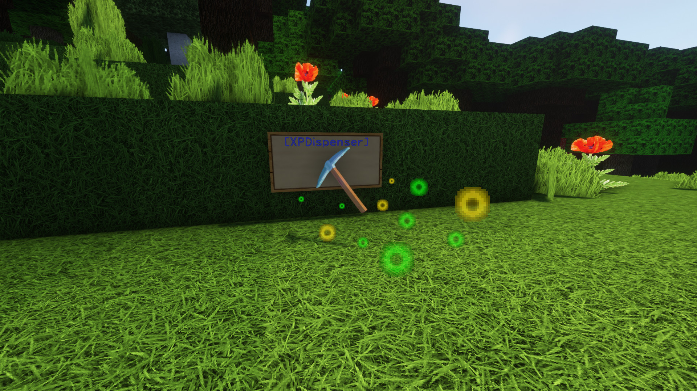

# XPDispenser

A Minecraft Bukkit plugin to throw your XP at yourself (e.g. to repair your mending tools).

## What is it?

XPDispenser allows you to throw XP orbs at yourself by using your currently collected XP points.

The collected XP points can be used to repair tools and armor enchanted with the mending enchantment. In that way, you are able to reuse your already collected XP points to repair your tools and armor.

## Permissions

Currently, there is only one permission available which controls whether a player is allowed to use this plugin: `xpdispenser` (Default: everyone)

## How to use it?

Simply place a sign at any location with the text `[XPDispenser]` at the first line.

Optionally, the second line contains the amount of XP points to be thrown in a single time (defaults to 10, if not given on the sign).

So, if you want to get 50 XP points, you can place a sign with the following content:

* First line: `[XPDispenser]`
* Second line: `50`

After correctly placing the sign, the color of the first line will change to blue.

To use the sign, simply interact with it (i.e. right click on it) while having the tool and/or armor to repair equipped.

### Why use a sign instead of a command?

It's simple: I just don't like to execute commands as a normal player, but I like to interact with the environment just like you would do in real life.

In case of this plugin, you could see the sign as some type of machine which will dispense some XP orbs.

## Build

You can build the project in the following 2 steps:

 * Check out the repository
 * Build the jar file using maven: *mvn clean package*

**Note:** JDK 1.8 and Maven is required to build the project!